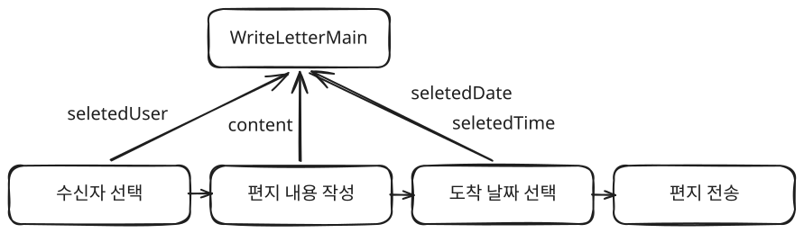
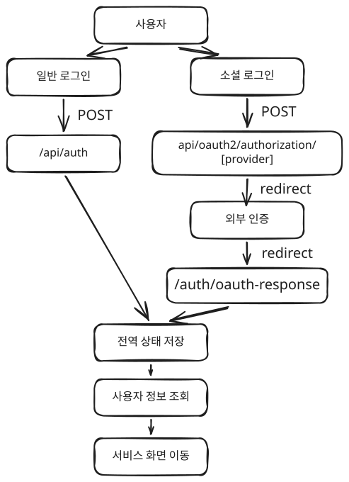

# 윤대영 포트폴리오

## 기술 숙련도

---

- React와 JavaScript를 활용한 컴포넌트 기반 UI 구현이 가능합니다.
- TypeScript를 활용하여 props, 상태값, API 응답 데이터의 타입을 정의할 수 있습니다.
- React Hooks와 커스텀 훅을 활용하여 상태 관리, 사이드 이펙트, 반복 로직을 분리할 수 있습니다.
- 상태의 사용 범위에 따라 지역 상태와 전역 상태를 구분하여 관리할 수 있습니다.
- REST API 연동을 통해 서버 데이터를 요청하고 화면 상태에 반영할 수 있습니다.

## 폐쇄형 메타버스 SNS, WOOMS

---

### 프로젝트 개요

- 소규모 그룹 안에서 편지, 사진, 방명록, 라디오로 추억을 저장하는 폐쇄형 메타버스 SNS
- 로그인/OAuth 인증 후 개인 공간, 그룹 공간 진입 구조
- 홈/그룹 공간 내 편지, 사진관, 사진 지도, 방명록, 라디오, 채팅 기능 제공
- 프론트엔드 개발 담당(인증/회원가입, 사용자 정보 수정, 편지 작성/조회, 기본 홈페이지)

### **문제 1. 홈/그룹 공간 위 전역 알림이 가려지는 문제 해결**

- **문제 원인**
    - 홈 화면, 그룹 화면, 전역 알림 레이어의 중첩 구조
    - 홈/그룹 공간 위에 전역 알림이 최상단으로 표시되어야 하는 요구사항
    - 전역 알림을 홈/그룹 화면 안에서 함께 렌더링하던 구조
    - 화면 구조와 z-index 영향을 받아 알림 위치 제어가 어려운 문제
- **해결 과정**
    - 홈/그룹 화면이 렌더링되는 `root`와 알림이 렌더링되는 영역 분리
    - `index.html`에 앱 루트와 분리된 `portal-root`를 추가하고 `Alert` 컴포넌트를 해당 영역에 렌더링
    - 화면 내부 z-index 조정이 아닌 별도 DOM 영역 렌더링으로 해결
- **결과**
    - 홈/그룹 공간 위 전역 알림 최상단 노출 안정화
    - 편지 작성 완료, 로그인 실패 등 공통 알림 표시 안정화
    - 알림 렌더링 위치 분리 구조 적용

### **문제 2. 편지 작성 중 단계 이동 시 입력값이 유실되는 문제 해결**

- **문제 원인**
    - 편지 작성 과정이 수신자 선택, 내용 작성, 도착 날짜 선택으로 분리된 구조
    - 편지 내용을 내용 작성 단계 컴포넌트 내부 state로만 관리
    - 다음 단계 이동 또는 뒤로가기 시 작성 단계가 사라지며 입력값 초기화
- **해결 과정**
    - 편지 작성 흐름 상위 컴포넌트 `WriteLetterMain` 기준 상태 관리
    - `selectedUser`, `content`, `selectedDate`, `sendDateTime` 상위 상태 이동
    - 하위 단계 컴포넌트 변경값을 `onChange` 콜백으로 상위 상태에 반영
    - 단계 전환 후에도 제출에 필요한 데이터 유지 구조 구성
- **결과**
    - 편지 작성 단계 이동 시 입력값 유실 방지
    - 수신자, 편지 내용, 도착 날짜의 일관된 상태 관리
    - 단계형 작성 UI와 사용자 입력 보존 흐름 동시 확보

### **문제 3. 로그인 방식별 인증 완료 흐름 분산 문제 해결**

- **문제 원인**
    - 일반 로그인과 OAuth 로그인 시작/복귀 지점 분리
    - 일반 로그인: `POST /api/auth` 후 사용자 정보 조회
    - OAuth 로그인: `/api/oauth2/authorization/{provider}` 이동 후 `/auth/oauth-response` 복귀
    - 로그인 방식별 사용자 정보 조회, 인증 상태 저장, 화면 이동 로직 중복 가능성
- **해결 방법**
    - 일반 로그인/OAuth 로그인 모두 동일한 인증 상태 갱신 흐름으로 정리
    - 로그인 완료 후, 공통으로 사용자 정보 조회 및 전역 인증 상태 저장
    - 로그아웃 시 인증 상태와 사용자 정보 초기화
- **결과**
    - 로그인 방식별 인증 후처리 흐름 일관화
    - 인증 이후 화면 이동 흐름 일관화
    - 메뉴바, 사용자 정보 수정, 인증 가드의 로그인 상태 판단 기준 통일

## 반려견 산책 공유 모바일 앱, 멍플

---

### 프로젝트 개요

- 반려견 보호자의 산책 경로, 거리, 기록을 저장하고 지역별 산책 정보를 제공하는 모바일
- 산책 중 위치 기반 데이터와 블루존(인기 산책 장소), 레드존(위험 지역), 멍플(실시간 산책 인기 지역) 정보를 실시간으로 확인하는 구조
- 산책 후 월간 캘린더, 일간 목록, 상세 지도, 통계 화면을 통해 산책 이력 회고 기능 제공
- 프론트엔드 개발 및 팀장 담당(실시간 데이터용 WebSocket 훅 분리, 산책 기록 화면, 반려견 관리 화면)

### **1. 팀 공통 WebSocket 사용 구조 설계로 실시간 산책 데이터 연동 방식 표준화**

#### **1-1. WebSocket 처리 방식 선정**

- **문제 원인**
    - 산책 위치, 산책 거리, 블루존, 레드존, 멍플 등 여러 실시간 데이터가 WebSocket 기반으로 제공되는 구조
    - 지도 화면, 산책 화면, 기록 화면 등 여러 화면에서 동일한 WebSocket 데이터와 송수신 함수 사용 필요
    - 팀원들이 각 화면에서 WebSocket 연결, 인증, 구독, 발행 로직을 직접 구현할 경우 중복 코드와 유지보수 비용 증가
    - 팀원별 구현 방식 차이로 구독 경로, 송수신 데이터 형식, 연결 해제 방식, 에러 처리 방식이 달라질 위험
- **고려한 방식**
    - 화면별 직접 구현: 구현은 빠르지만 구독 경로, 인증, 예외 처리 방식이 화면마다 분산되어 팀 공통 기능에 부적합
    - 전역 store 관리: 실제 시도했으나 소켓 저장이 비동기 상태 업데이트에 의존해 연결 직후 소켓 참조가 불안정하고, 소켓 저장 완료 대기 중 초기 실시간 데이터 소실 가능성 존재
    - custom hook 구현: React 생명주기와 연결 관리가 자연스럽고, 화면에서는 필요한 데이터와 함수만 가져다 쓰는 구조 구성 가능
- **해결 과정**
    - WebSocket 처리 방식을 `useWebSocket` 커스텀 훅으로 결정
    - STOMP Client 생성, 인증, 데이터 구독, 메시지 발행 함수를 훅 내부에서 통합 관리
    - 산책 위치 전송, 산책 거리 수신, 개인 블루존, 전체 블루존, 전체 레드존, 멍플 조회 함수를 훅 반환값으로 제공
    - 팀원이 화면에서 훅을 호출해 필요한 데이터와 함수만 사용하는 방식으로 사용 규칙 단순화
- **결과**
    - 팀 공통 WebSocket 사용 방식 확립
    - 전역 상태 업데이트 타이밍에 의존하지 않는 WebSocket 연결/구독 구조 확보
    - 구독 경로, 송수신 데이터 형식, 인증, 예외 처리 방식의 일관성 확보
    - 산책 중 위치·거리 기록 및 지역 기반 산책 정보 제공 기능의 공통 기반 마련

### **1-2. React Native WebSocket 환경 대응**

- **문제 원인**
    - STOMP.js 사용 시 React Native WebSocket 환경이 브라우저 WebSocket 환경과 다르게 동작할 수 있는 상황
    - React Native 환경에서 STOMP.js를 안정적으로 사용하기 위한 공식 문서 기반 설정 확인 필요
    - 실시간 산책 데이터 특성상 연결 유지, 재연결, 에러 수신 경로의 기본 안정성 확보 필요
- **해결 과정**
    - STOMP.js 문서를 확인해 React Native WebSocket 대응을 위한 polyfill 관련 옵션 적용
    - `appendMissingNULLonIncoming`, `forceBinaryWSFrames` 설정으로 React Native WebSocket 호환 옵션 적용
    - `/user/sub/errors` 에러 채널 구독으로 서버 오류 수신 경로 분리
    - `reconnectDelay`, `heartbeatIncoming`, `heartbeatOutgoing` 설정으로 연결 유지와 재연결 흐름 보완
- **결과**
    - React Native 환경에서 STOMP WebSocket 사용을 위한 기본 호환성 확보
    - 실시간 데이터 수신 중 연결 유지, 재연결 관련 불안 요소 완화
    - 문서 기반 옵션 적용으로 라이브러리 사용 안정성 개선